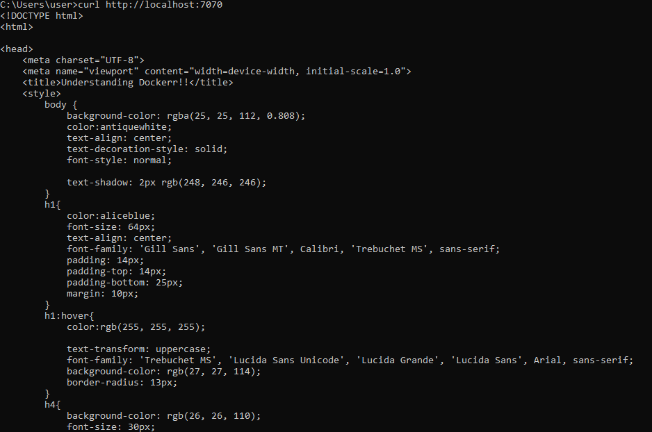
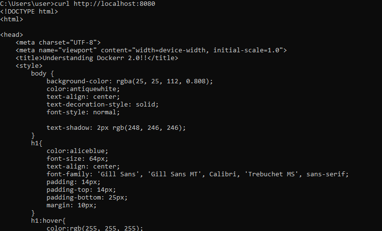
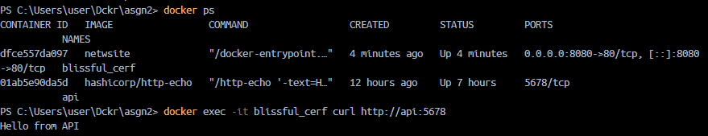

# dock-it-up-asgnsol
Submission of Dock it up! Bootcamp Tasks 

---
## Assignment 1
1. Creating a Docker Image for the website

   `Docker build -t d2site .`

2. Running it using the command

   `Docker run -d -p 7070:80 d2site`

3. Accessing via curl

   `curl http//localhost:7070`

5. Finding the container-id or container-name using 

   `Docker ps`

6. Stop the container using the `container-id` or `container-name`

   `Docker stop container-id`

   or

   `Docker stop container-name`

7. Remove the container

   `Docker rm container-id`

   or

   `Docker rm container-name`
   

   Curl Output:

   . 
   


---
## Assignment 2

1. Creating a Docker network
   
   ```docker network create webnet```

3. Buiding my nginx web container
   
   ```Docker build -t netwsite .```

5. Creating the API Container
   
    `docker run -d --name api --network webnet hashicorp/http-echo -text="Hello from API"`

7. Running the web container in webnet network with port 8080 exposed to host
   
   `Docker run -d --network webnet -p 8080:80 netwsite`

Images after testing with curl :


.
   
   
